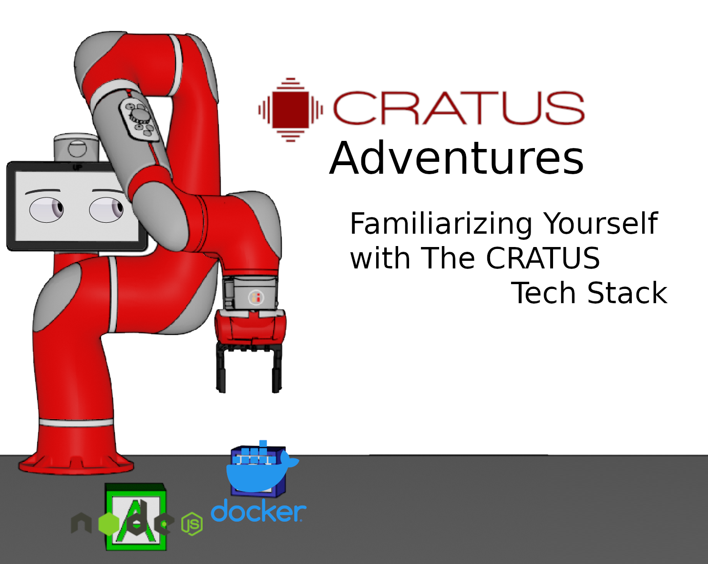

**Status:** Maintenance (expect bug fixes and additional demos)

 

# Cratus Adventures

Cratus Adventures is an exploration of the CRATUS Tech Stack.

These repos should function as a starting point for anyone new to Cratus. 
Inside you will find documentation and demos for Docker, Node, React, and more to come.
It functions as onboarding educational material and as an interviewing tool, however current CRATUS Devs may find the mistakes and musings within correctably humerous, or illuminating.

While these demos are not professional implementations intended for real world deployment, they could be enhanced to become a part of production if any of them extend upon the current rich feature set of CRATUS Tech.

## Prerequisites 
Cratus Adventures requires python3, flask, and docker.
node, react, and posgres will be future dependencies, but are not necesssary at the moment.

## Installation and Use
You will find README's with installation and execution instructions in the repo subdirectories.

## Features
- [DockerGeneral](/docker)
- [DockerLiveLoad-WebApp](/docker/demo_01)

## Future Features
These are necessary additions to Cratus Adventures that will be added with time.

- [NODE](/nodejs)
- [REACT](/react)
- [POSGRE](/posgre)
- [DockerPersistent](/posgres_flask_interaction)
- [ElegantlyHandlingCratusCrashes](/)